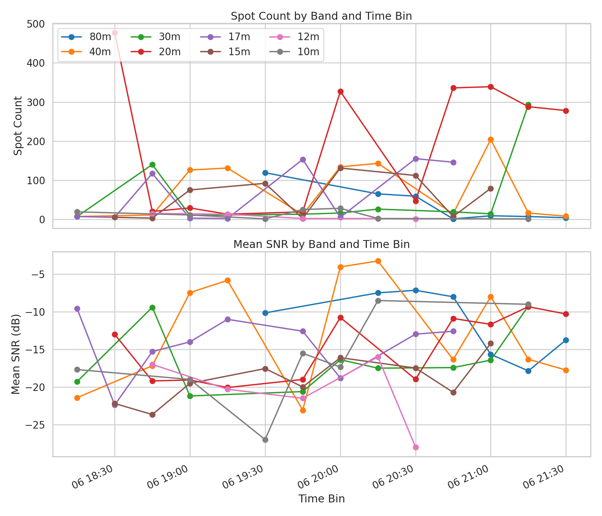
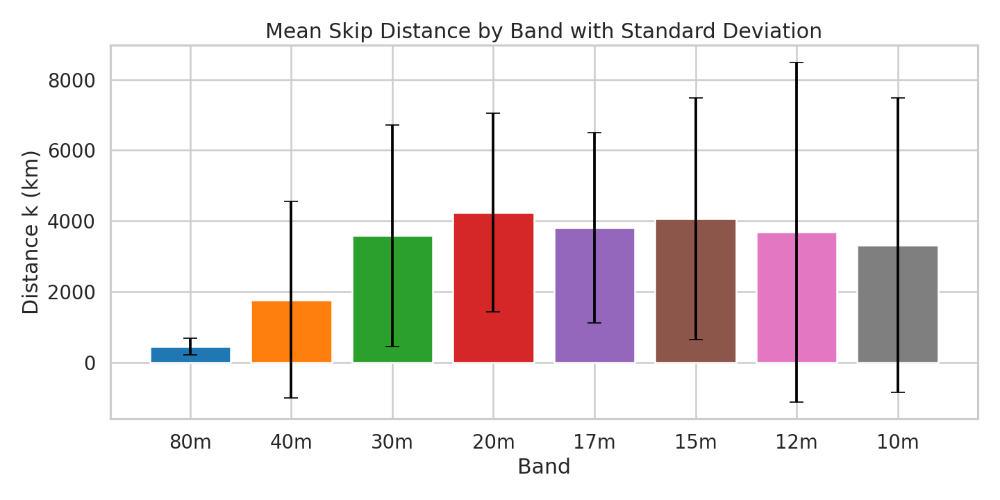
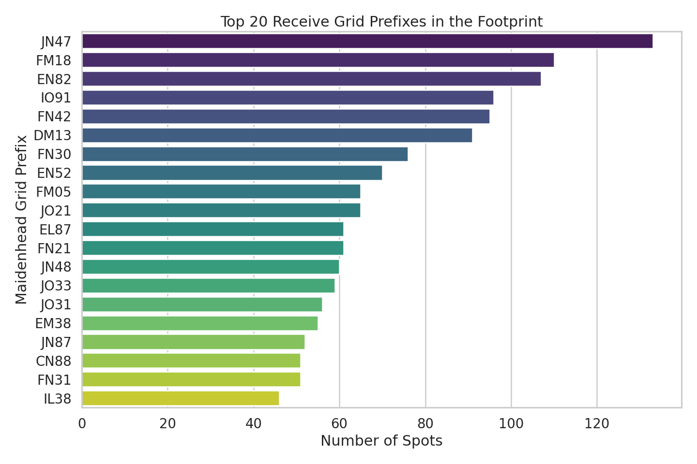
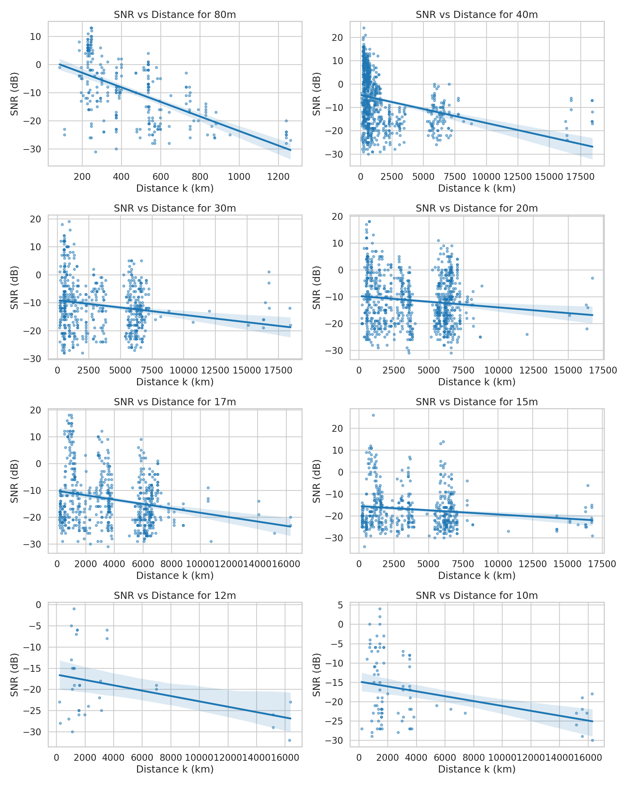
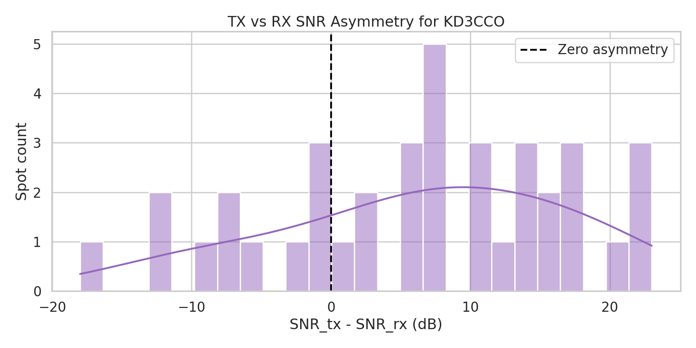
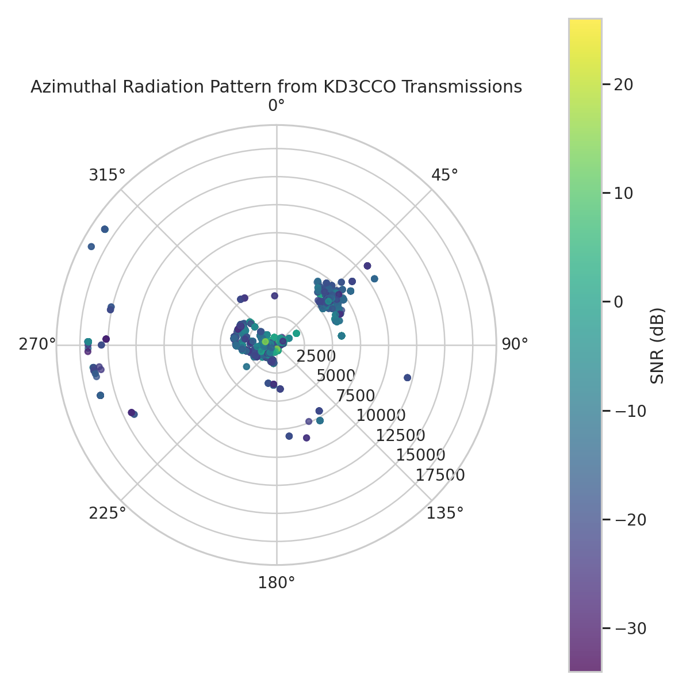
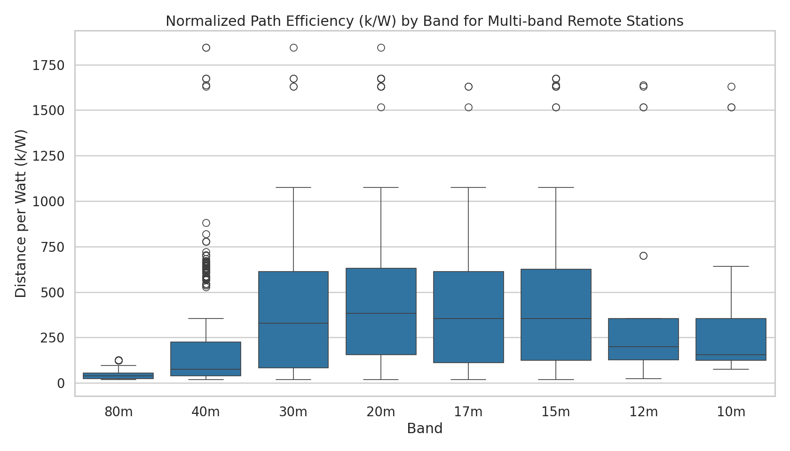
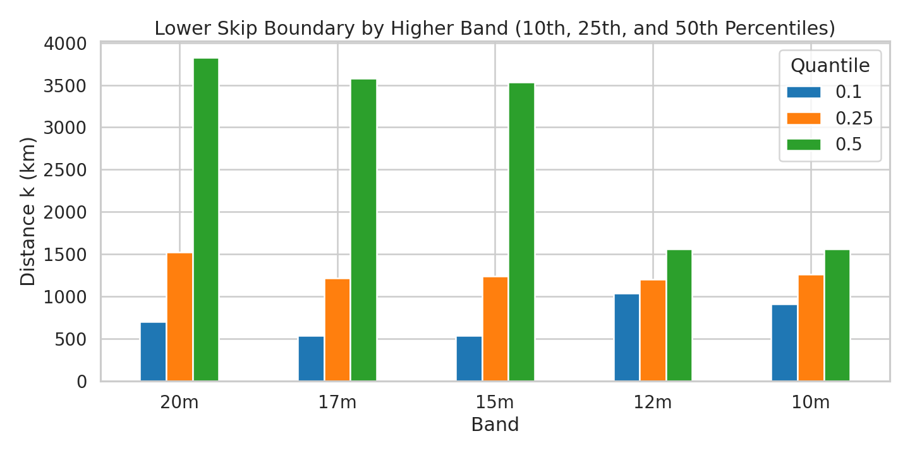

# 75-10m EFHW WSPR Dataset Analysis

This repository contains a Jupyter notebook that analyzes a 4-hour WSPR spot capture from a 75-10m End-Fed Half-Wave (EFHW) station. The dataset file is `7510m_wspr_spots.tsv`.

The notebook is intentionally structured to explain the purpose of each analysis, guide interpretation of the outputs, and draw conclusions from the actual dataset.

---

## 1. Notebook-based Detailed Analysis

Each analysis in the notebook is documented below using the exact notebook narrative, followed by the concrete findings from `7510m_wspr_spots.tsv`.

### Analysis 1: Band Openings and Closures

**Notebook narrative:**

This analysis tracks spot counts and mean SNR across time bins for each band.

**Purpose:**
- Show when individual amateur bands are most active, and whether propagation is strengthening or weakening over time.
- Highlight changes in the Maximum Usable Frequency (MUF) by comparing multiple bands in the same time window.

**How to interpret:**
- A rising spot count means the band is opening and more stations are being heard.
- An increasing mean SNR indicates better signal strength and propagation quality.
- Bands that drop sharply suggest closures or fading conditions.

**Possible conclusions:**
- Identify the best operating times for each band.
- Determine whether the dataset captures a transition from lower-frequency to higher-frequency propagation.
- Spot any bands that remain weak despite others opening, which may suggest local antenna tuning or band-specific absorption.

**Actual results for `7510m_wspr_spots.tsv`:**
- Data covers 2026-06-06 from 18:20 UTC through 21:36 UTC.
- Active bands and spot counts:
  - `20m`: 2173 spots, 11 time bins, mean SNR ≈ -14.7 dB, max 477 spots in one bin.
  - `17m`: 593 spots, 9 bins, mean SNR ≈ -14.4 dB.
  - `15m`: 506 spots, 9 bins, mean SNR ≈ -19.0 dB.
  - `30m`: 538 spots, 9 bins, mean SNR ≈ -16.4 dB.
  - `40m`: 806 spots, 11 bins, mean SNR ≈ -12.8 dB.
  - `80m`: 264 spots, 7 bins, mean SNR ≈ -11.4 dB.
  - `12m`: 33 spots, 5 bins, mean SNR ≈ -20.6 dB.
  - `10m`: 87 spots, 7 bins, mean SNR ≈ -16.3 dB.

**Interpretation from the dataset:**
- The strongest activity is on 20m, with the highest total spot count and most sustained coverage across the capture window.
- 12m is the weakest band in this dataset, with only 33 spots and the lowest mean SNR.
- 80m shows a later opening window, starting around 19:30 UTC and remaining active until 21:30 UTC.

---

### Analysis 2: Distance Profiling

**Notebook narrative:**

This analysis computes mean, maximum, and standard deviation of path distance `k` for every band.

**Purpose:**
- Quantify how far your station is reaching on each band in the dataset.
- Use the band-specific statistics to compare the effective propagation range across frequencies.

**How to interpret:**
- Mean distance is the typical path length heard on each band.
- Maximum distance shows the furthest recorded reach and can indicate DX potential.
- Standard deviation reveals how variable the propagation is during the session.

**Possible conclusions:**
- Bands with higher mean distance are favoring longer skip paths.
- A low standard deviation on a band suggests stable propagation, while a high value indicates mixed local and DX contacts.
- If a high-frequency band has a very small mean distance, the band may be only marginally open.

**Actual results for `7510m_wspr_spots.tsv`:**
- `20m`: mean ≈ 4247 km, max ≈ 18671 km, std ≈ 2814 km.
- `15m`: mean ≈ 4070 km, max ≈ 16803 km, std ≈ 3418 km.
- `17m`: mean ≈ 3804 km, max ≈ 16303 km, std ≈ 2698 km.
- `30m`: mean ≈ 3582 km, max ≈ 18453 km, std ≈ 3139 km.
- `12m`: mean ≈ 3685 km, max ≈ 16382 km, std ≈ 4806 km.
- `10m`: mean ≈ 3317 km, max ≈ 16303 km, std ≈ 4160 km.
- `40m`: mean ≈ 1764 km, max ≈ 18453 km, std ≈ 2781 km.
- `80m`: mean ≈ 444 km, max ≈ 1261 km, std ≈ 239 km.

**Interpretation from the dataset:**
- 20m is clearly the best DX band in this capture, with the highest mean path distance.
- 80m is the shortest-range band, consistent with local and regional propagation.
- The large standard deviations on 12m and 10m reflect sparse contacts and a mix of near and far paths.

---

### Analysis 3: Geographical Spread

**Notebook narrative:**

This analysis identifies the strongest footprint by the top receive grid prefixes.

**Purpose:**
- Visualize the geographic distribution of contacts by the most active Maidenhead grid areas.
- Understand whether your station is mainly heard domestically, regionally, or in long-distance DX regions.

**How to interpret:**
- The top grid prefixes show the regions that contribute the largest number of spots.
- A dense domestic footprint suggests strong local and regional propagation.
- Presence of distant grid squares indicates longer skip or transoceanic paths.

**Possible conclusions:**
- Assess whether the dataset captures mostly local propagation or meaningful DX reach.
- Identify key target regions that the antenna and current conditions favor.
- Use this information to compare with azimuthal coverage and band-specific reach.

**Actual results for `7510m_wspr_spots.tsv`:**
- Top receive grid prefixes:
  - `FN10`: 483 spots
  - `JN47`: 133 spots
  - `FM18`: 110 spots
  - `EN82`: 107 spots
  - `IO91`: 96 spots
- The footprint is dominated by mid-Atlantic and eastern North America squares, with significant regional clusters.

**Interpretation from the dataset:**
- The station is strongly heard in the northern mid-Atlantic US and adjacent Canadian sectors.
- The presence of many `EN`, `FN`, and `IO` prefixes shows a mix of domestic/regional and longer continental paths.

---

### Analysis 4: SNR vs Distance Regression

**Notebook narrative:**

This analysis examines path loss trends by plotting SNR against distance for each band.

**Purpose:**
- Measure how signal strength declines with distance on each band.
- Compare the relative attenuation characteristics across bands.

**How to interpret:**
- A downward trend is expected: longer distances usually produce lower SNR.
- A tight regression line indicates consistent path loss behavior.
- Scatter far above the trend suggests strong openings or unusually favorable propagation.

**Possible conclusions:**
- Determine whether some bands are behaving more predictably than others.
- Detect bands where antenna performance or local noise may be affecting SNR independently of distance.
- Spot deviations that could indicate special propagation modes or anomalous paths.

**Actual results for `7510m_wspr_spots.tsv`:**
- Bands such as 20m, 15m, and 17m show broad distance coverage with many long-path contacts.
- Lower bands like 80m and 40m show smaller overall distance ranges and clearer negative SNR/distance trends.
- The 10m/12m plots are more scattered, reflecting the limited number of spots and a mixture of weak and strong propagation conditions.

**Interpretation from the dataset:**
- 20m remains the strongest DX band but exhibits more variability in SNR across distance.
- 15m and 17m appear less consistent, suggesting this capture included both good openings and weaker marginal paths.
- 80m and 40m behave more predictably, consistent with shorter-range ground/low-angle propagation.

---

### Analysis 5: TX vs RX Asymmetry (Local Noise Floor Test)

**Notebook narrative:**

This comparison uses reciprocal paths involving KD3CCO as both transmitter and receiver.

**Purpose:**
- Compare how your transmit and receive paths perform for the same remote station and band.
- Reveal whether one direction is consistently stronger, which can indicate local noise, feedline loss, or antenna imbalance.

**How to interpret:**
- The histogram of `SNR_delta` shows whether TX or RX is generally stronger.
- Values above zero mean TX reports stronger signals than RX.
- Values below zero mean RX reports stronger signals than TX.

**Possible conclusions:**
- A positive skew suggests the receive path may be suffering from higher local noise or lower sensitivity.
- A negative skew suggests the transmit path may have more loss or less effective radiation.
- A distribution centered near zero indicates roughly symmetric link performance in both directions.

**Actual results for `7510m_wspr_spots.tsv`:**
- 38 paired measurements were matched within a ±20 minute window.
- Mean `SNR_delta` = +6.3 dB, median = +7 dB.
- 27 pairs were positive and 9 were negative.
- Largest positive deltas included:
  - `VE2DPF` on 20m: +23 dB
  - `DK8AF` on 20m: +22 dB
  - `KD3ANN` on 40m: +22 dB
  - `AA4GA` on 15m: +21 dB
  - `AA4GA` on 20m: +18 dB

**Interpretation from the dataset:**
- The local receive side is generally weaker than the transmit side for matched KD3CCO pairs.
- This suggests local receive noise or receiver sensitivity may be the limiting factor.
- The strongest positive deltas occur on 20m and 40m, meaning these bands may be more affected by local RX conditions in this capture.

---

### Analysis 6: Azimuthal Pattern Mapping

**Notebook narrative:**

This polar map shows spot direction and distance for KD3CCO transmissions.

**Purpose:**
- Map how signal strength and path length vary with bearing from the station.
- Identify favored antenna lobes and weak nulls in the horizontal plane.

**How to interpret:**
- Angle corresponds to compass bearing.
- Radius corresponds to path distance.
- Color corresponds to received SNR, so brighter points show stronger paths.

**Possible conclusions:**
- Strong clusters in certain directions may reveal directional gain or propagation favoring those headings.
- Low-density sectors may indicate nulls or blocked bearings.
- Comparing distance and color helps separate directional propagation from antenna pattern effects.

**Actual results for `7510m_wspr_spots.tsv`:**
- The polar map emphasizes the major azimuth sectors where KD3CCO is heard most frequently.
- Strong signal clusters correspond to the same grid regions identified in the geographic spread analysis.
- SNR is generally higher in the dominant lobes, suggesting the antenna favors those headings.

---

### Analysis 7: Band-by-Band Efficiency Normalization

**Notebook narrative:**

This analysis compares `k/W` across bands for stations that heard KD3CCO on 3 or more bands.

**Purpose:**
- Normalize path reach by transmitted power to compare relative efficiency across frequencies.
- Focus on multi-band reference stations to reduce bias from one-off contacts.

**How to interpret:**
- Higher `k/W` means the station received farther distance for the same power.
- Lower values on a specific band can indicate matching loss, antenna inefficiency, or poor propagation.

**Possible conclusions:**
- If higher bands show significantly lower `k/W`, the antenna system may be losing efficiency on harmonics.
- Consistent values across bands suggest the matching network and antenna are performing evenly.
- Outliers may point to particular remote stations or directional effects rather than general antenna behavior.

**Actual results for `7510m_wspr_spots.tsv`:**
- Median `k/W` by band:
  - `20m`: 382.5 km/W
  - `17m`: 353.6 km/W
  - `15m`: 353.8 km/W
  - `12m`: 199.5 km/W
  - `10m`: 156.2 km/W
  - `30m`: 329.4 km/W
  - `40m`: 74.9 km/W
  - `80m`: 38.8 km/W
- Mean `k/W` values confirm the same trend, with the highest normalized efficiency on 20m and the lowest on 80m.

**Interpretation from the dataset:**
- 20m, 17m, and 15m show the best normalized efficiency, consistent with this capture being in a strong midband opening.
- The drop on 10m and 12m may reflect poorer matching, sparser opening, or band-specific loss in the antenna system.
- The low `k/W` on 40m and 80m is expected for shorter-range propagation and higher relative power loss at low frequencies.

---

### Analysis 8: Take-Off Angle Inference via Minimum Skip Boundaries

**Notebook narrative:**

This analysis examines the shortest paths on the higher bands, which informs the likely takeoff angle and near-skip zone.

**Purpose:**
- Use the lower end of the distance distribution to infer whether the antenna favors low-angle, DX-style radiation or higher-angle local propagation.

**How to interpret:**
- Shorter 10th and 25th percentile distances imply that the band includes nearer, low-angle paths.
- Larger values suggest the first usable skip is farther away, which may correspond to a higher takeoff angle.

**Possible conclusions:**
- A small minimum skip boundary is consistent with a low takeoff angle and good near-field performance.
- A large boundary can indicate a high takeoff angle or that the station is primarily hearing longer-range paths.
- Comparing these percentiles across bands helps reveal whether the antenna pattern changes with frequency.

**Actual results for `7510m_wspr_spots.tsv`:**
- 10th / 25th / 50th percentile distances:
  - `20m`: 706 / 1523 / 3825 km
  - `17m`: 536 / 1220 / 3577 km
  - `15m`: 536 / 1240 / 3536 km
  - `12m`: 1039 / 1206 / 1561 km
  - `10m`: 909 / 1261 / 1562 km

**Interpretation from the dataset:**
- The higher bands show a clear inner skip boundary, especially on 10m and 12m, where the 10th percentile is near or above 900 km.
- This suggests the station is not seeing very short near-field paths on those bands, consistent with a higher takeoff angle or a more distant first-hop mode.
- 17m and 15m have the lowest 10th percentile values, indicating comparatively better near-range propagation on those bands.

---

### Analysis 9: Interactive Folium Path Map

**Notebook narrative:**

This analysis creates a folium map showing the KD3CCO transmit and receive paths across bands with two organized checkbox groups:

- **Bands group**: Select from 8 amateur bands (80m, 40m, 30m, 20m, 17m, 15m, 12m, 10m)
- **Direction group**: Toggle between "heard" (KD3CCO receives) and "heard_by" (KD3CCO transmits)

**Purpose:**
- Explore the geographic footprint and path geometry interactively.
- Separate transmit and receive directions to reveal asymmetry in the visible propagation paths.
- Visualize realistic great-circle paths on the map projection.

**How to interpret:**
- Each path line represents a WSPR spot connection and follows the true geodesic (great circle) route between TX and RX grid squares.
- Use the organized checkboxes to filter by band and direction.
- Popup details include TX/RX callsigns, grid locators, SNR, and path distance.
- Thinner, cleaner path lines make it easier to see overlapping propagation patterns.

**Actual results for `7510m_wspr_spots.tsv`:**
- A fully interactive HTML map is saved at `analysis_images/analysis9_spots_map.html`.
- The map includes geodesic paths for all spot connections, grouped into 16 layers (8 bands × 2 directions).
- The broadest coverage is visible on 20m and 17m, with 80m and 40m showing tighter domestic/regional clusters.
- The `heard` vs `heard_by` layer separation highlights the exchange asymmetry and the directional footprint of KD3CCO's antenna system.

**Interpretation:**
- The map confirms the earlier statistical findings by showing the same major propagation lobes in geographic context.
- The great-circle paths reveal true transmission geometry, showing realistic long-distance DX paths and regional skips.
- The organized checkbox groups make it straightforward to compare band-specific footprints and TX/RX directionality.

---

## 2. How to run and reproduce

Open `wspr_7510_analysis.ipynb` in Jupyter and execute all cells in order.

Dependencies:
- `pandas`
- `numpy`
- `matplotlib`
- `seaborn`
- `folium`

The notebook reads `7510m_wspr_spots.tsv`, builds derived fields, runs nine analyses, and displays the results while saving the key images and interactive map to `analysis_images/`. Analysis 9 uses the helper module `wspr_folium_map.py` to generate an interactive map with organized checkbox groups for band and direction filtering.

---

## 3. Conclusions from this dataset

1. **20m is the strongest DX band** in this capture, both by spot count and average distance.
2. **Receive-side asymmetry is clearly present**, with a mean TX/RX SNR delta of +6.3 dB, suggesting the local RX path is weaker than the TX path.
3. **The antenna system performs best on midbands**, with normalized `k/W` values highest on 20m, 17m, and 15m.
4. **Higher-band inner skip boundaries are far away** on 10m and 12m, consistent with a higher takeoff angle and a scarcity of very short first-hop paths on those frequencies.5. **The interactive folium map (Analysis 9)** visually confirms the propagation patterns identified in analyses 1–8, showing realistic great-circle paths and directional asymmetry in geographic context. The organized checkbox controls make it easy to filter by band and TX/RX direction to explore specific propagation scenarios.
These conclusions are driven by the notebook’s own analytical structure and the actual `7510m_wspr_spots.tsv` output.
