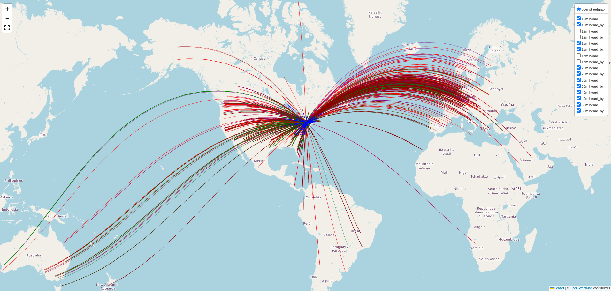

# 75-10m EFHW WSPR Dataset Analysis

This repository contains a Jupyter notebook that analyzes a WSPR spot capture from a 75-10m End-Fed Half-Wave (EFHW) station. The notebook is parameterized so you can point it at any TSV file or download data live from the wspr.live API.

The notebook is structured to explain the purpose of each analysis, guide interpretation of the outputs, and draw conclusions from the actual dataset.

---

## Configuration

At the top of the notebook, a single configuration cell controls all analyses:

```python
TSV_FILENAME      = '7510m_wspr_spots.tsv'   # local TSV path, or None
CALLSIGN          = 'KD3CCO'                 # station call sign to analyze
START_UTC         = None                     # e.g. '2026-06-01T00:00:00' or None
END_UTC           = None                     # e.g. '2026-06-07T23:59:59' or None
DOWNLOAD_FROM_API = False                    # True → download from wspr.live
```

- Set `DOWNLOAD_FROM_API = True` and `TSV_FILENAME = None` to fetch data live from the [wspr.live](https://wspr.live) ClickHouse API for the configured call sign and optional UTC window.
- Set `DOWNLOAD_FROM_API = False` and provide a `TSV_FILENAME` to analyze a local tab-separated file.
- `START_UTC` and `END_UTC` accept ISO-8601 strings and filter the dataset to that window regardless of which data source is used.

---

## 1. Notebook-based Detailed Analysis

Each analysis is documented below with its purpose, interpretation guide, and concrete findings from `7510m_wspr_spots.tsv`.

### Analysis 1: Band Openings and Closures

**Purpose:**
- Show when individual amateur bands are most active, and whether propagation is strengthening or weakening over time.
- Highlight changes in the Maximum Usable Frequency (MUF) by comparing multiple bands in the same time window.

**How to interpret:**
- A rising spot count means the band is opening and more stations are being heard.
- An increasing mean SNR indicates better signal strength and propagation quality.
- Bands that drop sharply suggest closures or fading conditions.

**Possible conclusions:**
- Identify the best operating times for each band.
- Determine whether the dataset captures a transition from lower-frequency to higher-frequency propagation.
- Spot any bands that remain weak despite others opening, which may suggest local antenna tuning or band-specific absorption.

**Actual results for `7510m_wspr_spots.tsv`:**
- Data covers 2026-06-06 from 18:20 UTC through 21:36 UTC.
- Active bands and spot counts:
  - `20m`: 2173 spots, 11 time bins, mean SNR ≈ -14.7 dB, max 477 spots in one bin.
  - `40m`: 806 spots, 11 bins, mean SNR ≈ -12.8 dB.
  - `30m`: 538 spots, 9 bins, mean SNR ≈ -16.4 dB.
  - `17m`: 593 spots, 9 bins, mean SNR ≈ -14.4 dB.
  - `15m`: 506 spots, 9 bins, mean SNR ≈ -19.0 dB.
  - `80m`: 264 spots, 7 bins, mean SNR ≈ -11.4 dB.
  - `10m`: 87 spots, 7 bins, mean SNR ≈ -16.3 dB.
  - `12m`: 33 spots, 5 bins, mean SNR ≈ -20.6 dB.

**Interpretation from the dataset:**
- The strongest activity is on 20m, with the highest total spot count and most sustained coverage across the capture window.
- 12m is the weakest band in this dataset, with only 33 spots and the lowest mean SNR.
- 80m shows a later opening window, starting around 19:30 UTC and remaining active until 21:30 UTC.


---

### Analysis 2: Distance Profiling

**Purpose:**
- Quantify how far your station is reaching on each band in the dataset.
- Use the band-specific statistics to compare the effective propagation range across frequencies.

**How to interpret:**
- Mean distance is the typical path length heard on each band.
- Maximum distance shows the furthest recorded reach and can indicate DX potential.
- Standard deviation reveals how variable the propagation is during the session.

**Possible conclusions:**
- Bands with higher mean distance are favoring longer skip paths.
- A low standard deviation on a band suggests stable propagation, while a high value indicates mixed local and DX contacts.
- If a high-frequency band has a very small mean distance, the band may be only marginally open.

**Actual results for `7510m_wspr_spots.tsv`:**
- `20m`: mean ≈ 4247 km, max ≈ 18671 km, std ≈ 2814 km.
- `15m`: mean ≈ 4070 km, max ≈ 16803 km, std ≈ 3418 km.
- `17m`: mean ≈ 3804 km, max ≈ 16303 km, std ≈ 2698 km.
- `30m`: mean ≈ 3582 km, max ≈ 18453 km, std ≈ 3139 km.
- `12m`: mean ≈ 3685 km, max ≈ 16382 km, std ≈ 4806 km.
- `10m`: mean ≈ 3317 km, max ≈ 16303 km, std ≈ 4160 km.
- `40m`: mean ≈ 1764 km, max ≈ 18453 km, std ≈ 2781 km.
- `80m`: mean ≈ 444 km, max ≈ 1261 km, std ≈ 239 km.

**Interpretation from the dataset:**
- 20m is clearly the best DX band in this capture, with the highest mean path distance.
- 80m is the shortest-range band, consistent with local and regional propagation.
- The large standard deviations on 12m and 10m reflect sparse contacts and a mix of near and far paths.


---

### Analysis 3: Geographical Spread

**Purpose:**
- Visualize where the configured station's transmissions are being received, by counting the top Maidenhead grid prefixes among receiving stations.
- Understand whether the station is mainly heard domestically, regionally, or in long-distance DX regions.

**How to interpret:**
- Only spots where the configured callsign is the transmitter are counted, so the grid prefixes represent the locations of receiving stations.
- A dense domestic footprint suggests strong local and regional propagation.
- Presence of distant grid squares indicates longer skip or transoceanic paths.

**Possible conclusions:**
- Assess whether the dataset captures mostly local propagation or meaningful DX reach.
- Identify key target regions that the antenna and current conditions favor.
- Use this information to compare with azimuthal coverage and band-specific reach.

**Actual results for `7510m_wspr_spots.tsv`:**
- Top 20 receive grid prefixes (stations hearing KD3CCO):

| Rank | Grid | Count | Region |
|------|------|-------|--------|
| 1 | JN47 | 133 | Central Europe (Austria/Germany) |
| 2 | FM18 | 110 | Mid-Atlantic US (Washington DC area) |
| 3 | EN82 | 107 | Upper Midwest US |
| 4 | IO91 | 96 | Southern England |
| 5 | FN42 | 95 | Northeastern US |
| 6 | DM13 | 91 | Southwestern US |
| 7 | FN30 | 76 | Northeastern US |
| 8 | EN52 | 70 | Central US |
| 9 | FM05 | 65 | Mid-Atlantic US |
| 9 | JO21 | 65 | Netherlands/Belgium |
| 11 | EL87 | 61 | Gulf Coast US |
| 11 | FN21 | 61 | Northeastern US |
| 13 | JN48 | 60 | Central Europe |
| 14 | JO33 | 59 | Northern Germany |
| 15 | JO31 | 56 | Netherlands |
| 16 | EM38 | 55 | South-Central US |
| 17 | JN87 | 52 | Northern Italy/Switzerland |
| 18 | CN88 | 51 | Pacific Northwest US |
| 18 | FN31 | 51 | Northeastern US |
| 20 | IL38 | 46 | North Africa/Canary Islands |

**Interpretation from the dataset:**
- The footprint is genuinely transatlantic, with strong representation in both Europe (JN47, IO91, JO21, JN48, JO33, JN87) and across North America.
- The eastern US and central Europe dominate, consistent with 20m propagation during a late-afternoon/evening opening.
- Coverage reaching IL38 (North Africa / Canary Islands area) indicates long-path propagation was active during the capture window.


---

### Analysis 4: SNR vs Distance Regression

**Purpose:**
- Measure how signal strength declines with distance on each band.
- Compare the relative attenuation characteristics across bands.

**How to interpret:**
- A downward trend is expected: longer distances usually produce lower SNR.
- The shaded band around each regression line is the 95% confidence interval on the fit — a narrower band means the linear trend is better supported by the data.
- Scatter far above the trend suggests strong openings or unusually favorable propagation.

**Possible conclusions:**
- Determine whether some bands are behaving more predictably than others.
- Detect bands where antenna performance or local noise may be affecting SNR independently of distance.
- Spot deviations that could indicate special propagation modes or anomalous paths.

**Actual results for `7510m_wspr_spots.tsv`:**
- Bands such as 20m, 15m, and 17m show broad distance coverage with many long-path contacts.
- Lower bands like 80m and 40m show smaller overall distance ranges and clearer negative SNR/distance trends.
- The 10m/12m plots are more scattered, reflecting the limited number of spots and a mixture of weak and strong propagation conditions.

**Interpretation from the dataset:**
- 20m remains the strongest DX band but exhibits more variability in SNR across distance.
- 15m and 17m appear less consistent, suggesting this capture included both good openings and weaker marginal paths.
- 80m and 40m behave more predictably, consistent with shorter-range ground/low-angle propagation.


---

### Analysis 5: TX vs RX Asymmetry (Local Noise Floor Test)

**Purpose:**
- Compare how the transmit and receive paths perform for the same remote station and band.
- Reveal whether one direction is consistently stronger, which can indicate local noise, feedline loss, or antenna imbalance.

**How to interpret:**
- The histogram of `SNR_delta` (`SNR_tx − SNR_rx`) shows whether TX or RX is generally stronger.
- Values above zero mean the remote station reports a stronger signal from KD3CCO than KD3CCO reports from the remote.
- Values below zero mean the opposite.

**Possible conclusions:**
- A positive skew suggests the receive path may be suffering from higher local noise or lower sensitivity.
- A negative skew suggests the transmit path may have more loss or less effective radiation.
- A distribution centered near zero indicates roughly symmetric link performance in both directions.

**Actual results for `7510m_wspr_spots.tsv`:**
- 38 paired measurements were matched within a ±20 minute window.
- Mean `SNR_delta` = +6.3 dB, median = +7 dB.
- 27 pairs were positive and 9 were negative.
- Largest positive deltas: `VE2DPF` on 20m (+23 dB), `DK8AF` on 20m (+22 dB), `KD3ANN` on 40m (+22 dB), `AA4GA` on 15m (+21 dB).

**Interpretation from the dataset:**
- The local receive side is generally weaker than the transmit side for matched KD3CCO pairs.
- This suggests local receive noise or receiver sensitivity may be the limiting factor.
- The strongest positive deltas occur on 20m and 40m, meaning those bands may be most affected by local RX conditions.


---

### Analysis 6: Azimuthal Pattern Mapping

**Purpose:**
- Map how signal strength and path length vary with bearing from the station.
- Identify favored antenna lobes and weak nulls in the horizontal plane.

**How to interpret:**
- Angle corresponds to compass bearing.
- Radius corresponds to path distance.
- Color corresponds to received SNR, so brighter points show stronger paths.

**Possible conclusions:**
- Strong clusters in certain directions may reveal directional gain or propagation favoring those headings.
- Low-density sectors may indicate nulls or blocked bearings.
- Comparing distance and color helps separate directional propagation from antenna pattern effects.

**Actual results for `7510m_wspr_spots.tsv`:**
- The polar map emphasizes the major azimuth sectors where KD3CCO is heard most frequently.
- Strong signal clusters correspond to the same grid regions identified in the geographic spread analysis.
- SNR is generally higher in the dominant lobes, suggesting the antenna favors those headings.


---

### Analysis 7: Band-by-Band Efficiency Normalization

**Purpose:**
- Normalize path reach by transmitted power to compare relative efficiency across frequencies.
- Focus on multi-band reference stations to reduce bias from one-off contacts.

**How to interpret:**
- Higher `k/W` means the station received farther distance for the same power.
- Lower values on a specific band can indicate matching loss, antenna inefficiency, or poor propagation.

**Possible conclusions:**
- If higher bands show significantly lower `k/W`, the antenna system may be losing efficiency on harmonics.
- Consistent values across bands suggest the matching network and antenna are performing evenly.
- Outliers may point to particular remote stations or directional effects rather than general antenna behavior.

**Actual results for `7510m_wspr_spots.tsv`:**
- Median `k/W` by band: `20m` 382.5, `17m` 353.6, `15m` 353.8, `30m` 329.4, `12m` 199.5, `10m` 156.2, `40m` 74.9, `80m` 38.8 km/W.

**Interpretation from the dataset:**
- 20m, 17m, and 15m show the best normalized efficiency, consistent with a strong midband opening.
- The drop on 10m and 12m may reflect poorer matching, sparser opening, or band-specific loss in the antenna system.
- The low `k/W` on 40m and 80m is expected for shorter-range propagation and higher relative power loss at low frequencies.


---

### Analysis 8: Take-Off Angle Inference via Minimum Skip Boundaries

**Purpose:**
- Use the lower end of the distance distribution to infer whether the antenna favors low-angle, DX-style radiation or higher-angle local propagation.

**How to interpret:**
- Shorter 10th and 25th percentile distances imply that the band includes nearer, low-angle paths.
- Larger values suggest the first usable skip is farther away, which may correspond to a higher takeoff angle.

**Possible conclusions:**
- A small minimum skip boundary is consistent with a low takeoff angle and good near-field performance.
- A large boundary can indicate a high takeoff angle or that the station is primarily hearing longer-range paths.
- Comparing these percentiles across bands helps reveal whether the antenna pattern changes with frequency.

**Actual results for `7510m_wspr_spots.tsv`:**
- 10th / 25th / 50th percentile distances:
  - `20m`: 706 / 1523 / 3825 km
  - `17m`: 536 / 1220 / 3577 km
  - `15m`: 536 / 1240 / 3536 km
  - `12m`: 1039 / 1206 / 1561 km
  - `10m`: 909 / 1261 / 1562 km

**Interpretation from the dataset:**
- The higher bands show a clear inner skip boundary, especially on 10m and 12m, where the 10th percentile is near or above 900 km.
- 17m and 15m have the lowest 10th percentile values, indicating comparatively better near-range propagation on those bands.


---

### Analysis 9: Interactive Folium Path Map

**Purpose:**
- Explore the geographic footprint and path geometry interactively.
- Separate transmit and receive directions to reveal asymmetry in the visible propagation paths.

**How to interpret:**
- Each path line represents a WSPR spot and follows the true great-circle route between TX and RX grid squares.
- Use the layer checkboxes to filter by band and by role (heard / heard_by).
- Popup details include TX/RX callsigns, grid locators, SNR, and path distance.

**Actual results for `7510m_wspr_spots.tsv`:**
- A fully interactive HTML map is saved at `analysis_images/analysis9_spots_map.html`.
- The map includes geodesic paths grouped into 16 layers (8 bands × 2 directions).
- The broadest coverage is on 20m and 17m; 80m and 40m show tighter domestic/regional clusters.



---

## 2. Conclusions from this dataset

1. **20m is the strongest DX band** in this capture, both by spot count and average distance.
2. **The footprint is transatlantic**, with significant reception in central Europe alongside broad North American coverage.
3. **Receive-side asymmetry is clearly present**, with a mean TX/RX SNR delta of +6.3 dB, suggesting the local RX path is weaker than the TX path.
4. **The antenna system performs best on midbands**, with normalized `k/W` values highest on 20m, 17m, and 15m.
5. **Higher-band inner skip boundaries are far away** on 10m and 12m, consistent with a higher takeoff angle and a scarcity of very short first-hop paths on those frequencies.

---

## 3. Reproducing the environment

This project uses a conda environment defined in `environment.yaml`.

### Create and activate the environment

```bash
conda env create -f environment.yaml
conda activate wspr_analysis
```

### Run the notebook

```bash
jupyter lab wspr_7510_analysis.ipynb
```

Execute all cells top to bottom. Edit the configuration cell at the top to change the input file, callsign, time bounds, or data source before running.

### Update an existing environment

If `environment.yaml` changes after you have already created the environment:

```bash
conda env update -f environment.yaml --prune
```
