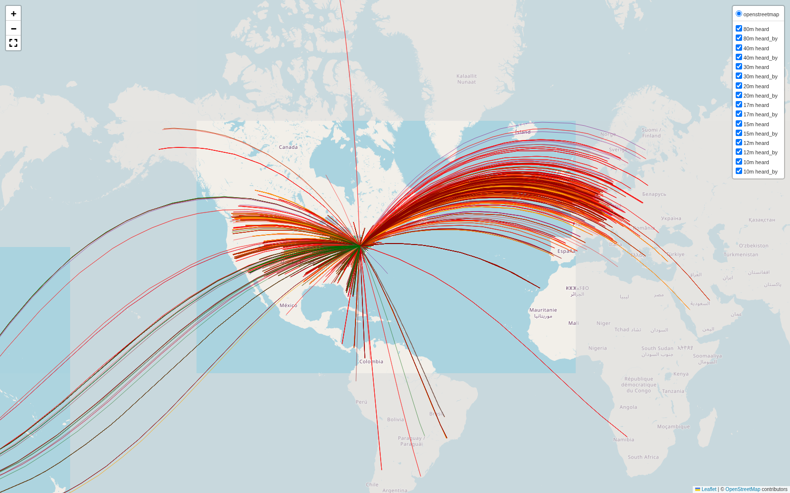
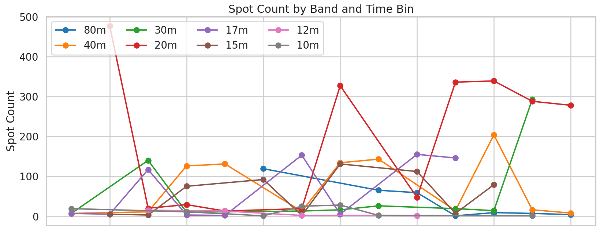
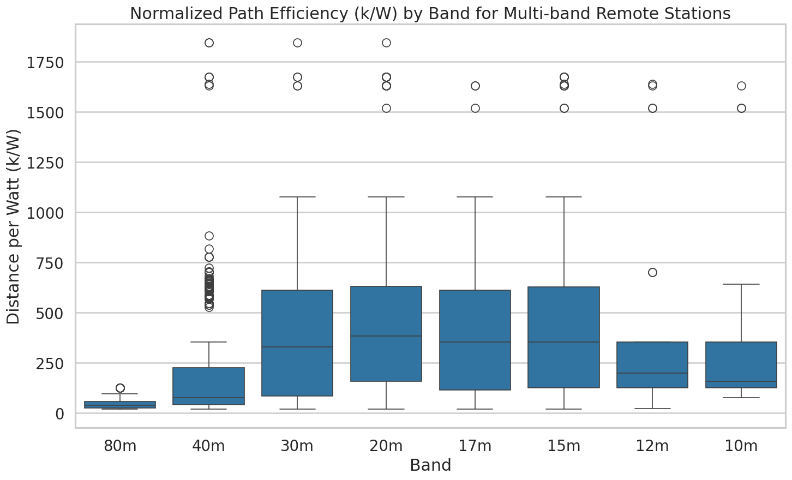
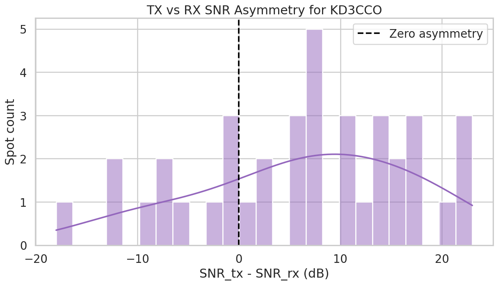
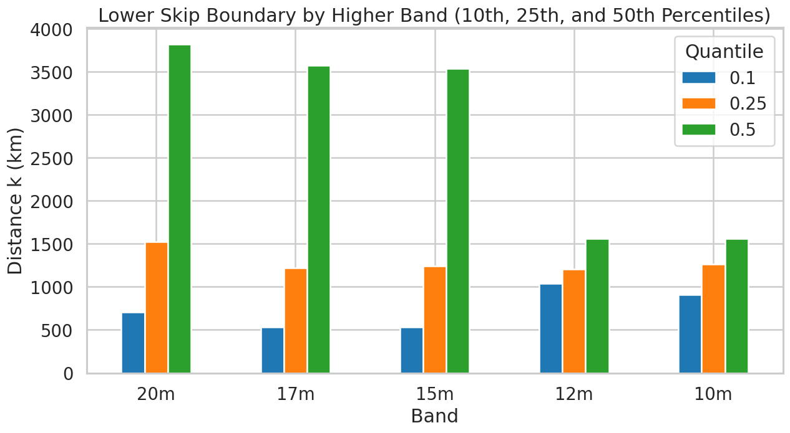
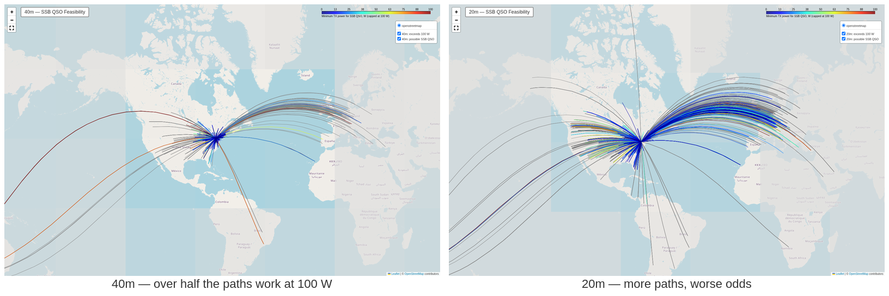

<!-- _class: title -->
<!-- _paginate: false -->
<!-- _footer: "" -->

# Asking a wire what it actually does

**KD3CCO**

One evening of WSPR, ten analyses, and several things I had wrong

---

# I built a 75–10 m end-fed half-wave and had no honest way to judge it

The SWR meter says the transmitter is comfortable. It says nothing about where the signal goes, which bands the thing is really good on, or whether the problem is me.

On the air it is worse: you work someone, or you do not, and you never find out which part was responsible.

I wanted a measurement, not an impression.

---

<!-- _class: evidence -->

# One evening of WSPR answered it — 5,000 receptions, on two continents



<span class="caption">Every line is one reception of my signal by a real receiver, or of theirs by mine, 2026-06-06, 18:20–21:36 UTC.</span>

---

# Every WSPR spot is a calibrated measurement that somebody else paid for

A WSPR transmission is two minutes of a few watts carrying nothing but a callsign, a grid square, and a power level.

Hundreds of volunteer receivers decode it and upload what they heard, **with the signal-to-noise ratio attached**.

You do not need their equipment, their time, or their permission. You need a TSV file and an evening.

---

<!-- _class: evidence -->

# The band worth being on changed three times in three hours



<span class="caption">Spot count per band per 15 minutes. 30 m peaks at 19:00, 17 m at 20:30, 20 m runs away with it after 20:15.</span>

---

<!-- _class: evidence -->

# It is a midband antenna, whatever the name on the label says



<span class="caption">Distance per watt, per band. 20 m 383 km/W, 17 m 354, 15 m 354 — against 75 km/W on 40 m and 39 on 80 m.</span>

---

<!-- _class: evidence -->

# The surprise was that my receiver, not my antenna, is the weak end



<span class="caption">38 matched pairs where the same station and I heard each other within 20 minutes. Mean delta +6.3 dB in favor of transmit — that is local noise, in my house and my neighborhood.</span>

---

<!-- _class: evidence -->

# On 10 and 12 m, almost nothing closer than 900 km could hear me at all



<span class="caption">10th percentile distance by band. A far inner skip boundary means a high takeoff angle — the harmonic modes of an EFHW are not a pattern anyone designed.</span>

---

<!-- _class: evidence -->

# Spots become a decision: where a voice contact would actually have worked



<span class="caption">WSPR SNR is referenced to roughly an SSB bandwidth, so it scales with power. 40 m: 55% of paths clear a 3 dB margin within 100 W. 20 m: 818 workable paths, but only 38% of its spots.</span>

---

# The whole thing runs from one configuration cell

```python
TSV_FILENAME      = '7510m_wspr_spots.tsv'   # a file from wspr.rocks
CALLSIGN          = 'KD3CCO'
START_UTC         = None                     # or '2026-06-06T18:00:00'
END_UTC           = None
DOWNLOAD_FROM_API = False
```

Point it at your own callsign and your own capture and every figure in this talk rebuilds itself.

I have since run the same notebook against a 20 m dipole, a 15 m dipole, and a center-loaded 40 m dipole on a mast — which is the actual point. **Comparisons between antennas are worth more than a number for any one of them.**

---

<!-- _class: evidence -->

# An AI coding assistant reads your whole repository, and that changes which projects are worth starting


Hobby time arrives as confetti: twenty minutes before dinner, an hour on a Sunday. What decides whether a project happens is not the work in it — it is how much progress fits inside one of those fragments. Ten separate analyses of one evening's spots was never going to happen otherwise.

---

<!-- _class: evidence -->

# The gain is not just faster and better code — it is the practices the AI made affordable


<span class="caption">Interfaces, failure modes and what happens when a part is missing, all decided in the document before anything exists. Here it produced test files for the great-circle geometry, because a plausible-looking map is the easiest thing in the world to get wrong.</span>

---

# Its best trick is telling me what I did not know to ask

**Argue with it for an hour at two in the morning** without spending a friend's patience. In a solo hobby, that back-and-forth was the scarce ingredient.

**Then turn it against your own design.** I write down how I think something should work, and ask for an analysis of alternatives — and specifically: *does this design imply there are tools, techniques or facts out there that I am not accounting for?*

It is a retrieval system over what other people have already worked out. Use it as one.

---

<!-- _class: evidence -->

# Code, documentation, slides and the blog in one window, where the assistant can see all of it


<span class="caption">Documentation is markdown in the repository, beside the code. Everything advances in the same sitting, so nothing drifts. The blog is another repository in the same workspace; these slides are markdown in this one.</span>

---

# This is the cheapest experiment in amateur radio

No new hardware. A few watts, an evening, and a receiver network that already exists.

**Transmit WSPR tonight on whatever you already have up.** Download the spots tomorrow. You will learn more about your antenna in one evening than in a year of "how's my signal."

Then change one thing — height, feedpoint, a different wire — and do it again.

---

<!-- _class: closing -->

# Measure the antenna you have before you buy the next one

**Notebook, dataset, and all ten analyses**
github.com/hatandspecs/wspr_7510_analysis

**Write-up, with every figure and what it means**
hatandspecs.github.io/hamradio/articles/7510-wspr-results-analysis/

Also run against a 20 m dipole, a 15 m dipole, and a loaded 40 m dipole — same notebook, four antennas.

**KD3CCO** — questions welcome
